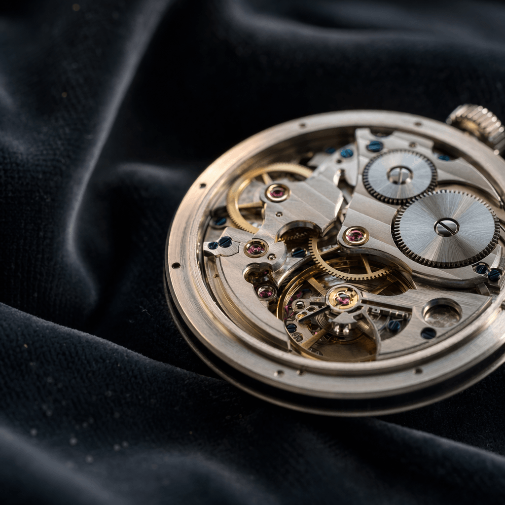

```
██╗███╗   ███╗ █████╗  ██████╗ ███████╗      ██████╗ 
██║████╗ ████║██╔══██╗██╔════╝ ██╔════╝      ╚════██╗
██║██╔████╔██║███████║██║  ███╗█████╗  █████╗ █████╔╝
██║██║╚██╔╝██║██╔══██║██║   ██║██╔══╝  ╚════╝██╔═══╝ 
██║██║ ╚═╝ ██║██║  ██║╚██████╔╝███████╗      ███████╗
╚═╝╚═╝     ╚═╝╚═╝  ╚═╝ ╚═════╝ ╚══════╝      ╚══════╝

╔═╗╦ ╦╔═╗╔╦╗╔═╗╔═╗╔╦╗
║  ╠═╣╠═╣ ║ ║ ╦╠═╝ ║ 
╚═╝╩ ╩╩ ╩ ╩ ╚═╝╩   ╩ 
```

A [Claude Code](https://docs.claude.com/en/docs/claude-code) skill for OpenAI's `gpt-image-2`. Opinionated for the three jobs it actually wins on: **editorial typography, multi-image composition, and dense infographics.**

One tool. Routes text prompts through `/images/generations` and multi-reference prompts through `/images/edits` automatically. Ships with battle-tested recipes, a prompting playbook, and a complete failure-mode cheatsheet. MIT. Fork-friendly.

---

## The real superpower: research-grounded accuracy

Most image models hallucinate specifics. `gpt-image-2` is wired into ChatGPT's deep-research pipeline — it can look up references on the live web and bake **actual visual details** into the output. Name a real product, a real brand, a real person, a real logo, a real location, a real historical reference, and the model pulls the visuals from real sources instead of inventing them.

Practical impact:

- **Logos and wordmarks render correctly** (not warped hallucinations)
- **Real products match their real packaging, colors, and proportions**
- **Editorial references to real people, places, and events keep accurate period detail**
- **App icons, mascots, and UI elements match the live ecosystem** (e.g. Slack, Gmail, Drive, Notion render as themselves)
- **Technical diagrams reference real topologies** (chip layouts, architecture patterns, molecular structures)

This is the mechanism behind everything the model is good at. Editorial typography, multi-reference composition, dense infographics — all land better because the model isn't guessing what things look like. Describe real things in your prompt and the output is a usable first draft, not a "close enough" approximation.

---

## See it work in 30 seconds

```bash
node tools/generate.js \
  --prompt 'Minimal poster on cream background, single bold serif word: SHIPPED. Black ink, generous whitespace.' \
  --size 1024x1024 --quality low \
  --output ./shipped.png
```

Legible typography, correct spelling, clean composition, first try. That's the sell.

---

## What this skill is for

Three jobs `gpt-image-2` genuinely nails:

1. **Legible typography inside the image.** Posters, magazine spreads, infographics with real headlines and body copy. Text rendering accuracy sits above 95% across Latin, CJK, and Arabic scripts.
2. **True multi-reference composition.** The Edits endpoint accepts up to 16 reference images and combines them into one scene. Pass `product + lifestyle + brand asset`, get one image back.
3. **Structured layouts.** Grids, hierarchy, spacing, "do exactly this" prompts. `gpt-image-2` follows spatial instructions rather than hallucinating a vibe.

---

## Examples

Three opinionated recipes. Clone the repo, drop any of these into `tools/generate.js --prompt "..."`, and you'll have the output in a couple of minutes.

### 1. Product launch infographic — 9:16 portrait, 4K


*Rendered at `2160x3840` — true 4K portrait at the 8.29M pixel cap.*

**Prompt:**

```
Portrait infographic poster on a pale cream-to-lavender gradient background.

Headline "ChatGPT Agents" in bold condensed sans-serif, with the word "Agents" rendered in a vibrant blue-to-purple gradient. Small "NEW" pill badge above the headline. Subtitle: "Your AI teammate that thinks, acts, and gets things done."

To the right of the title, a 3D-rendered friendly chatbot mascot -- chrome-white sphere with glowing cyan eyes -- surrounded by orbiting rings and floating app-icon cards (calendar, spreadsheet, globe, document).

Three pill badges below the subtitle: "Autonomous", "Reliable", "Works for you".

Section "What they can do" -- a six-card grid. Each card has a small 3D icon, a colored title, and a 3-line description. Cards: Research, Analyze, Create, Take action, Automate, Integrate. Rounded corners, subtle shadows, consistent padding.

Trust band with a lock icon: "You stay in control. Agents act on your behalf, never without your permission."

Section "Easier than ever to get started" -- three numbered steps in rounded pills, each with a supporting UI mini-mockup.

Footer: deep blue-to-purple gradient bar with a rocket icon and the copy "More done. Less effort." OpenAI wordmark on the right.

Typography: bold sans-serif headlines, regular sans body. Palette: cream background, navy text, lavender/violet/cyan accents. Photorealism in the 3D mascot and icons. No extra text beyond what is specified.
```

Run: `node tools/generate.js --prompt "..." --size 2160x3840 --quality high`

**Why it works.** The dense layout forces the model to hold composition across many sub-regions -- hero, grid, trust band, steps, footer -- while keeping typography legible at every scale. The 3D mascot and the real app-icon cards come out accurate because the model pulls each icon from actual references. This is the class of asset that would otherwise take 3-5 hours in Figma.

---

### 2. Editorial magazine cover — 2:3 portrait, 6.3MP


*Rendered at `2048x3072` — 2:3 portrait, 6.3M pixels.*

**Prompt:**

```
Editorial magazine cover, portrait orientation. Contemporary 2026 art direction, post-internet aesthetic, bold and saturated.

Full-bleed hero: a photorealistic overhead shot of a matte-black mechanical keyboard partially submerged in a shallow pool of reflective liquid chrome on a polished concrete surface. Dramatic side-lighting from upper-left, saturated electric-violet gradient wash across the background, warm amber accent from lower-right. Crisp modern photography, no film grain, no vintage treatment.

Overlay typography, all in bright white:
- Masthead "FORESIGHT" top-left, small all-caps sans-serif, wide tracking, thin weight
- Date tag top-right, tiny monospace: "VOL. 04 / 2026"
- Hero line "THE END OF THE KEYBOARD" set in huge bold display sans-serif, 60% of frame height, broken across three flush-left stacked lines, positioned lower-left
- Deck beneath hero in thin sans-serif white: "Voice, vision, and ambient computing are replacing the thing you are using to read this."

Modern editorial layout, high-contrast, saturated palette. Not a 1990s treatment. No other text.
```

Run: `node tools/generate.js --prompt "..." --size 2048x3072 --quality high`

**Why it works.** Contemporary magazine covers are about three things working together: full-bleed hero photography, a saturated and confident color palette, and massive display type that reads as editorial instead of retro. `gpt-image-2` holds all three simultaneously — the keyboard render stays photorealistic while the overlaid masthead, date tag, hero line, and deck each occupy distinct type scales without blurring into each other. Drop the "1990s treatment" instruction explicitly or you'll get bookstore-vintage every time.

---

### 3. Editorial portrait with a person + real brand environment — 16:9 landscape, 4K


*Rendered at `3840x2160` — true 4K 16:9 at the 8.29M pixel cap. Real person, real products, real location, all in one composition.*

**Prompt:**

```
Cinematic editorial portrait, landscape 16:9. A female barista in her early 30s with short dark hair tucked behind her ears and subtle forearm tattoos, wearing a navy denim apron over a simple white t-shirt, concentrated focused expression, hands working the brass grouphead of a polished stainless and brass La Marzocco Linea Mini espresso machine.

Golden-hour morning light streaming through large industrial factory-style windows on the left, illuminating fine steam rising from the grouphead and casting long warm shadows across a reclaimed walnut counter.

Background: softly blurred but recognizable -- a Blue Bottle Coffee shop interior in Williamsburg Brooklyn. The Blue Bottle wordmark and bottle icon visible on a ceramic mug in the midground. A red Mazzer grinder to the right. A chalkboard menu in the deep background. A soft out-of-focus customer seated at a window bench with a silver MacBook Pro.

Technical: shot on a 50mm lens at f/2.0, shallow depth of field, sharp focus on the barista hands and on a thin dark-amber espresso stream pouring into a Kinto double-wall glass cup. Photorealism. 35mm film grain, warm color grade, natural skin tones, true-to-life fabric texture, realistic steam wisps.

Candid, unposed editorial feel. Documentary photography aesthetic. No text overlays, no captions, no logos invented. Render all visible brand marks accurately.
```

Run: `node tools/generate.js --prompt "..." --size 3840x2160 --quality high`

**Why it works.** This single frame is doing what no other image model can hold simultaneously: a **real person** in a natural action pose, **multiple identifiable real brands in the same scene** (La Marzocco Linea Mini grouphead, Blue Bottle Coffee logo, Mazzer grinder, Kinto glass cup, MacBook Pro), a **real geographic location** (Blue Bottle Williamsburg aesthetic), **cinematic lighting direction**, and **documentary photography grammar** (50mm f/2.0, 35mm film grain, shallow DOF). The prompt layering — person → primary product action → brand environment → technical camera specs — is the recipe. Use this skeleton for any "person-plus-product" editorial: chef at a Le Creuset pass, photographer with a Leica Q3 in Shoreditch, architect at an Aeron chair in a Brooklyn studio. Swap the roles and brands, keep the layered structure, and the model ships a first-draft editorial photo every time.

---

### 4. Research-grounded brand grid (30 logos) — 16:9 landscape, 4K


*Rendered at `3840x2160` — true 4K 16:9 at the 8.29M pixel cap. **30 real brand logos in one composition.***

**Prompt:**

```
Tech infographic, landscape. Title "THE AI STACK — 2026" in bold display sans-serif, top center on a warm cream-to-sand gradient background. Small monospace subtitle directly below: "30 labs, tools, and platforms defining the year".

Main composition: a precise grid of 30 square cards arranged in 5 rows of 6, evenly spaced with consistent generous padding. Each card is clean white with subtle rounded corners and a soft neutral shadow. Inside each card, centered: one real company logo mark in full color rendered with high accuracy at the top, and the company name in clean sans-serif directly beneath. Logo + name only (no descriptor text, to keep density legible).

The 30 companies in reading order:
Row 1 (frontier labs): OpenAI, Anthropic, Google DeepMind, Meta AI, Mistral, xAI
Row 2 (models and discovery): Cohere, Perplexity, Hugging Face, DeepSeek, Alibaba Qwen, 01.AI
Row 3 (image and audio): Midjourney, Runway, Pika, Luma, ElevenLabs, Suno
Row 4 (developer tools): Cursor, GitHub Copilot, Replit, Vercel, Lovable, Bolt
Row 5 (infra and apps): LangChain, LlamaIndex, Pinecone, Notion AI, Figma AI, Adobe Firefly

Thin navy horizontal rules separating the 5 rows with small uppercase row-label text on the left margin. Uniform card sizing, neat vertical and horizontal alignment across all 30 cards. Modern editorial layout. Photorealism and accuracy in every logo. No extra text beyond the title, subtitle, row labels, and the 30 company names.
```

Run: `node tools/generate.js --prompt "..." --size 3840x2160 --quality high`

**Why it works.** This is the research-grounded-accuracy claim at stress-test scale. **Thirty distinct real brand logos in one image** — frontier labs, model providers, image/audio tools, dev tools, infra and apps — each rendered with correct color, silhouette, and word-mark, all on a uniform grid with visible row labels and clean typographic hierarchy. No other image model holds this density of real-logo fidelity AND layout AND legible sub-type simultaneously. The pattern is extensible: swap the 30 companies for any category (SaaS in your industry, portfolio companies for a VC deck, speaker logos for a conference, integration partners for a product landing page) and the same structure ships in one render. `gpt-image-2` handles high-count grids surprisingly well — push to 36, 42, even 48 cards for denser landscape maps.

---

## Further inspiration — from OpenAI's launch gallery

Capabilities we didn't render ourselves but the model absolutely handles. All three images below are from OpenAI's official gpt-image-2 documentation and are reproduced here as reference for what's possible. Source: [developers.openai.com/api/docs/guides/image-generation](https://developers.openai.com/api/docs/guides/image-generation).

### Multi-image reference composition (Edits endpoint)


*Source: OpenAI gpt-image-2 docs.* Demonstrates the `/images/edits` endpoint combining multiple product reference images into one coherent scene — lotion, candle, soap, ribbon, and a handwritten "Relax & Unwind" label. This is the flow we expose via `--reference-image` stacked calls.

### Artistic and surreal composition


*Source: OpenAI gpt-image-2 docs.* Prompt: *"River made of white owl feathers through winter landscape."* Shows the model's range beyond editorial realism — impossible-in-reality imagery rendered with atmospheric depth. Use this direction for book covers, editorial spreads with a conceptual angle, artistic social-media visuals.

### Intricate mechanical / product detail



*Source: OpenAI gpt-image-2 docs.* Fine-gear watch movement — jewels, hand-finishing, intricate internal mechanism. Demonstrates the model's precision for e-commerce detail shots, patent-style illustrations, hero product renders where the subject IS the detail.

---

## Install

```bash
git clone https://github.com/vdruts/ChatGPT-Image-2 ~/.claude/skills/chatgpt-image-2
cd ~/.claude/skills/chatgpt-image-2
npm install
```

Claude Code auto-discovers skills in `~/.claude/skills/`. Restart your session and `chatgpt-image-2` is available.

## Configure

Two one-time things.

**1. API key.** Set `OPENAI_API_KEY` in your environment, or drop it into `~/.claude/.env`. The tool checks `process.env`, then `./.env`, then `~/.claude/.env`, then `<skill-dir>/.env`.

**2. Organization verification.** OpenAI gates `gpt-image-2` behind ID-based org verification. Go to [platform.openai.com/settings/organization/general](https://platform.openai.com/settings/organization/general) and click Verify Organization. The verification itself takes about two minutes. Propagation to the API can take another fifteen to thirty. Until it clears you will get `403 Your organization must be verified`.

## Use from Claude Code

Once installed, describe what you want in natural language. The skill's triggers route requests involving "infographic", "meta ad", "viral LinkedIn image", "combine these images", or explicit mentions of "ChatGPT Images" / "gpt-image-2".

Example prompts that route here:

- *"Make me an infographic on the 5 stages of customer awareness."*
- *"Combine these 3 product photos into one lifestyle shot."*
- *"Create a viral LinkedIn image for a post on prompt engineering being dead."*

## Use from the CLI

### Text to image

```bash
node tools/generate.js \
  --prompt 'Editorial magazine cover. Bold serif headline reading "PRECISION" in black ink on a cream background. Geometric red and black accents, Bauhaus-inspired. No extra text.' \
  --size 1024x1536 \
  --quality high \
  --output ./cover.png
```

### Multi-image composition

Pass `--reference-image` multiple times. The tool switches to the Edits endpoint and composes:

```bash
node tools/generate.js \
  --prompt 'A premium gift basket on a white studio background. Image 1: body lotion, placed at back-left. Image 2: candle, placed center. Image 3: soap, placed front-right. Add a cream ribbon and a handwritten "Relax and Unwind" label. Preserve product labels exactly.' \
  --reference-image ./body-lotion.png \
  --reference-image ./candle.png \
  --reference-image ./soap.png \
  --output ./giftbasket.png
```

### All options

```
--prompt "<text>"               Required. Image description.
--reference-image <path>        Repeatable (up to 16). Adds a reference. Triggers Edits endpoint.
--output <path>                 Output path. Default: ./output.png
--size <size>                   Any WxH satisfying: max edge ≤ 3840, both
                                multiples of 16, long:short ≤ 3:1, AND total
                                pixels ≤ 8,294,400 (~8.3M, the hard cap).
                                Common: 1024x1024, 1024x1536, 1536x1024,
                                2048x2048, 2048x3072, 3072x2048, 3840x2160
                                (4K wide), 2160x3840 (4K tall), 2880x2880
                                (max square), 3840x1280 (3:1 ultrawide),
                                auto. Default: auto
--quality <quality>             low | medium | high | auto. Default: high
--model <model>                 gpt-image-2 | gpt-image-1.5 | gpt-image-1 | gpt-image-1-mini.
                                Default: gpt-image-2
--moderation <level>            auto | low. Default: auto
--n <count>                     Number of images to generate (1-4). Default: 1
```

---

## Prompting playbook

Distilled from OpenAI's cookbook guide, fal.ai's prompting notes, and a stack of real tests. Treat these as defaults, not dogma.

### 1. Structure beats length

Write your prompt in this order. Long rambling paragraphs underperform short labeled segments.

```
Scene / background  ->  Subject  ->  Key details  ->  Typography  ->  Constraints
```

Front-load what matters. `gpt-image-2` processes language sequentially. **The first ten words of your prompt carry the most visual weight.** If the headline is the point, say "Editorial poster with the headline 'X'" before describing the background.

### 2. Text rendering rules

This is where `gpt-image-2` earns its premium. Use the rules or you will lose them.

- **Always quote the exact text.** `'a poster reading "SHIPPED"'`. Unquoted text gets paraphrased.
- **Specify placement and typography.** Font style (serif / sans / mono), size (large / medium / small), weight, color, and position. "Bold serif, centered, 40% of frame height, black on cream."
- **Demand verbatim rendering.** Add `no extra text`, `no duplicate letters`, `no hallucinated words`. Models love to sprinkle filler.
- **Spell out tricky words letter by letter** for brand names or non-dictionary terms: `the word "ACME" (A-C-M-E)`.
- **Use `--quality high`** for small text, dense information panels, and multi-font layouts. `medium` blurs fine type.
- **Put every piece of text in its own quoted phrase** if you have multiple copy blocks. "Headline 'X', subhead 'Y', CTA 'Z'." Don't run them together.

### 3. Multi-reference labeling pattern

When using the Edits endpoint with 2+ references, label every image by role and reference the labels in your instruction:

```
Image 1: base scene to preserve
Image 2: jacket to composite onto the subject in Image 1
Image 3: boots to composite onto the subject in Image 1
```

Then: *"Apply Image 2 and Image 3 to the subject in Image 1. Keep Image 1's lighting, background, and camera angle unchanged."*

Without labels, the model guesses which reference is canonical. With labels, it follows instructions.

### 4. Preserve-and-change language

For surgical edits, state both sides explicitly. The model drifts otherwise.

- **Change only:** `"Replace the jacket with the one from Image 2."`
- **Keep:** `"Keep the face, hair, pose, background, lighting, and color temperature unchanged."`

Repeat the preserve list on every iteration. Drift compounds across edits.

### 5. Lighting and materials

Lighting separates flat images from cinematic ones. Be specific.

- "Fluorescent ceiling light mixed with neon signage glow"
- "Dramatic orange-red gradient backlight, subject in silhouette"
- "Golden hour natural light, low angle, warm shadows"

Materials: name textures, surfaces, reflectivity. "Matte cream paper, no gloss." "Brushed aluminum with fingerprint smudges." Generic prompts produce generic images.

### 6. Quality levers (use sparingly)

Add these ONLY when the base prompt underdelivers. Stacking them turns output mushy:

- `photorealism` is the single highest-leverage word for lifelike output. Drop it into any prompt aiming for a real-photo look and the realism jumps exponentially. Skip it for illustration, poster, or editorial-graphic work.
- `film grain` / `35mm` for analog warmth
- `macro detail` / `shallow depth of field` for product shots
- `candid, unposed` to defeat the default polished-studio look
- `hand-drawn, pencil texture` for editorial illustration

### 7. Aspect ratio and resolution (up to 4K)

`gpt-image-2` accepts any `WxH` that satisfies four constraints (per OpenAI's official docs):

- **Max edge ≤ 3840px** (true 4K long edge)
- **Both edges are multiples of 16**
- **Long-to-short ratio ≤ 3:1**
- **Total pixels between 655,360 and 8,294,400** (the hard cap — this is the one people miss)

That opens up a much wider design space than "1024 or 1536." The ratio changes the reading experience as much as the content does — test at least two ratios for hero images. Defaults by use case:

| Ratio | Use case | Standard | 4K / hi-res |
|---|---|---|---|
| 1:1 | Instagram post, avatar, square poster | `1024x1024` | `2880x2880` (at cap) |
| 2:3 | LinkedIn portrait, magazine cover | `1024x1536` | `2048x3072` |
| 3:2 | Editorial landscape, hero banner | `1536x1024` | `3072x2048` |
| 16:9 | YouTube thumbnail, widescreen hero | — | `3840x2160` (4K, at cap) |
| 9:16 | Reels, TikTok, Stories, vertical mobile | — | `2160x3840` (4K, at cap) |
| 4:3 | Classic photo landscape | `1024x768` | `3200x2400` |
| 3:4 | Classic photo portrait | `768x1024` | `2400x3200` |
| 2:1 | Wide banner, ticket-style layout | `1536x768` | `3072x1536` |
| 3:1 | Max-allowed ultrawide (hero strip, OG header) | — | `3840x1280` |

Notes:
- **`1920x1080` does NOT work** — 1080 is not a multiple of 16. Use `3840x2160` for exact 16:9 at 4K, or `1920x1088` for a close-to-16:9 frame at 2K.
- **`auto`** lets the model choose a shape that matches your prompt. Useful early. Lock a specific size once the composition is committed.
- **Cost scales with `size × quality`.** 4K at `--quality high` is the most expensive combination. The standard workflow: iterate at `1024` on `--quality low`, commit the composition, then re-render the winning prompt at 4K on `--quality high` for the final deliverable.
- **High-DPI screens and print love 4K.** 3840px on the long edge maps cleanly to retina displays and gives you headroom for poster print at 300 DPI up to ~13 inches.

---

## Recipes

`recipes/` contains battle-tested prompt skeletons for the three highest-leverage cases. Read the relevant one before composing your own. They encode aspect ratios, composition rules, and the specific gotchas for each use case.

- [`recipes/infographic.md`](recipes/infographic.md) - stats, frameworks, educational visuals
- [`recipes/meta-ad.md`](recipes/meta-ad.md) - FB / IG ad creative with hook overlay + context
- [`recipes/viral-linkedin.md`](recipes/viral-linkedin.md) - high-contrast typographic scroll-stops

---

## Failure modes and fixes

From OpenAI's own cookbook plus lived experience:

| Symptom | Fix |
|---|---|
| Text illegible or wrong characters | `--quality high`, quote the text, spell out tricky words letter-by-letter |
| Identity drifts across edits | Restate the preserve list every iteration |
| Unwanted creative reinterpretation | Add "no new elements", "preserve layout and perspective", lock specifics |
| Overpolished / stock-photo feel | Use "candid, unposed, natural light" instead of "studio, cinematic" |
| Duplicate / extra words appear | Add `no extra text`, `no duplicate letters`, `single headline only` |
| Compositing looks pasted-on | Name the lighting and shadows explicitly. "Match lighting from Image 1." |
| Slow generation (>60s) | Drop to `--quality medium`, or reduce reference image count |

---

## Costs

Per-call pricing is a function of size x quality x input image tokens (for multi-reference composition). Check [OpenAI pricing](https://platform.openai.com/docs/pricing) for current numbers. Two rules of thumb:

- Text-to-image at `--quality low` is cheap enough to iterate freely.
- Multi-reference edits at `--quality high` stack token costs fast. Every reference is processed at high fidelity. Budget accordingly.

---

## Limitations

- No transparent backgrounds on `gpt-image-2`. Omit `background: transparent` from prompts.
- Complex prompts can take up to two minutes. Plan for it.
- Org verification required (one-time, about two minutes plus propagation).
- Subject to OpenAI rate limits. Your tier determines throughput.

---

## When NOT to use this skill

- **Multi-slide carousel decks** -> use a carousel-specific tool. `gpt-image-2` generates one image at a time and cannot hold layout continuity across slides.
- **Realtime / streaming generation** -> not supported by `gpt-image-2`.
- **Transparent PNGs** -> not supported. Composite externally or use a different model.

---

## License

MIT. See [LICENSE](LICENSE).

## Contributing

Issues and PRs welcome. Particularly interested in:

- Additional recipes (book covers, ebook mockups, app store screenshots)
- Aesthetic profiles for common brand systems
- Cost reporting / token accounting helpers
- Extended preserve-list patterns for multi-step editing workflows

---

## References

- [OpenAI Cookbook - GPT Image Models Prompting Guide](https://developers.openai.com/cookbook/examples/multimodal/image-gen-models-prompting-guide)
- [OpenAI Image Generation API Docs](https://developers.openai.com/api/docs/guides/image-generation)
- [fal.ai - GPT Image 2 Prompting Guide](https://fal.ai/learn/tools/prompting-gpt-image-2)
